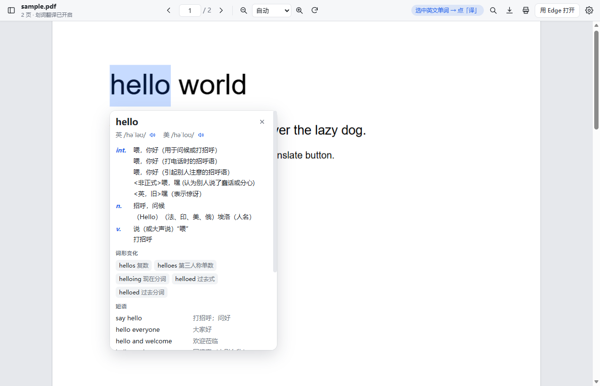
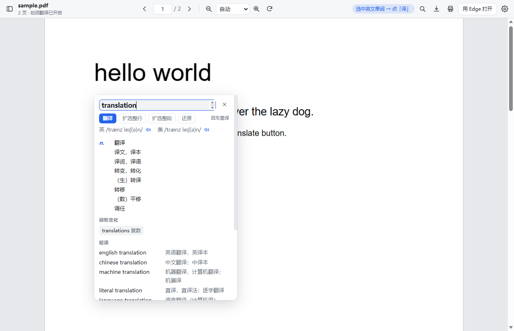
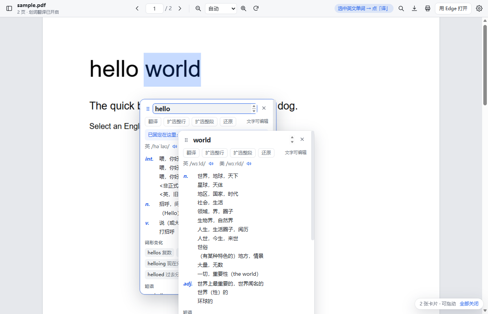
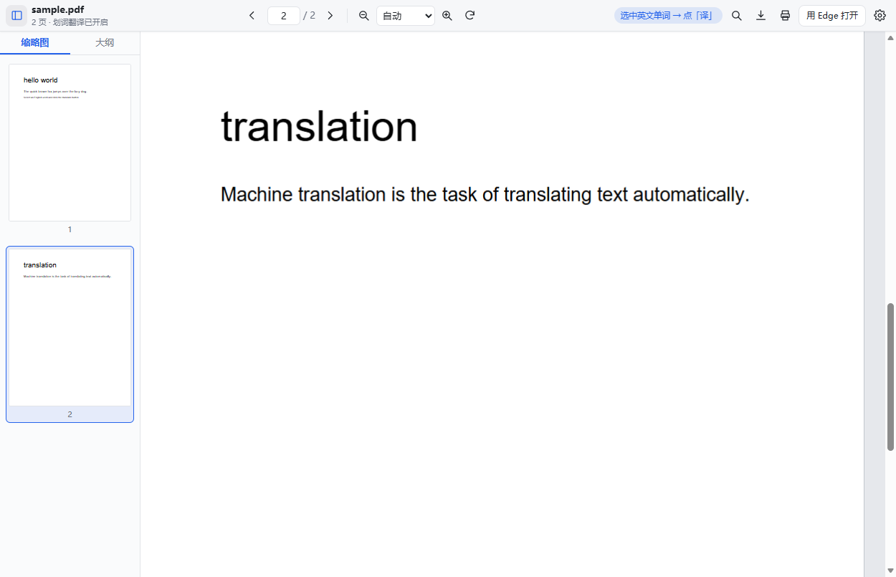
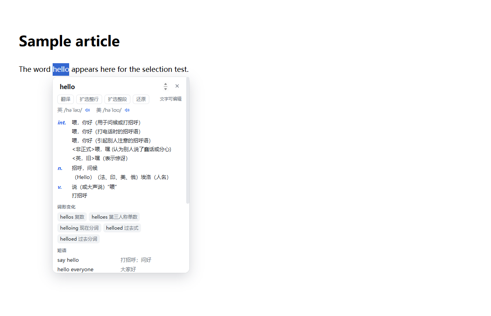

# PDF Translate on Select

**English** | [简体中文](README.zh-CN.md)

> Read PDFs in Microsoft Edge and look up English words without leaving the page:
> select a word → click **译** (translate) → get Chinese definitions with part of speech,
> phonetics, pronunciation, word forms, phrases and bilingual examples.




---

## Why does this need its own PDF viewer?

**Because the built-in PDF viewer cannot be scripted — by anyone.** Edge renders PDFs in a
browser-internal page (`edge://…`) that no third-party extension can inject a content script
into, so an extension can never see *which word you selected*. This is a deliberate Chromium
security boundary, not a missing feature. Every "translate a PDF by selecting text" extension
(including the PDF mode of well-known translation extensions) works around it the same way:
ship a viewer.

So this extension renders the PDF with [pdf.js](https://mozilla.github.io/pdf.js/) in its own
page, which puts the text layer inside our DOM — and that is what makes selection-based lookup
possible at all. To keep the intrusion small:

* only **top-level** PDF tabs are taken over; PDFs embedded in a page (`<iframe>`) are left alone
  (the popup can open one in the viewer on demand);
* the viewer toolbar always has an **用 Edge 打开 / Open in Edge** button that hands the tab back
  to the native viewer (and remembers that choice for that URL for 30 minutes);
* turning off *Auto-take over PDFs* in the settings restores the default browser behaviour
  completely — web-page selection lookup still works.

## Features

**Selection & lookup**

* Select a word (double-click works as expected in the viewer) → a blue **译** button appears →
  click it for a card with part of speech, UK/US phonetics, audio, word forms, phrases and
  bilingual examples.
* Selecting a full sentence switches to sentence translation; selecting Chinese looks up
  English instead.
* `Alt+Shift+T` translates the current selection; a right-click menu item does the same, plus
  "open this PDF in the translate viewer" on `.pdf` links.
* Works on ordinary web pages too (can be turned off).

**Fixing incomplete selections** — the usual pain when selecting text in a paper

* The text at the top of the card **is an editor**: fix it and press `Enter` to re-translate.
* **扩选整行 / Expand to line** and **扩选整段 / Expand to paragraph** rebuild the full line or
  paragraph from the PDF text layer and replace the page selection, so you can see the highlight
  grow. **还原 / Restore** goes back to the original selection.

**Multiple cards and dragging**

* Every lookup opens its own card; a second lookup does not replace the first one.
* Drag a card by the grip in its top-left corner to pin it anywhere (pinned cards stop following
  the selection and get a thin blue outline; double-click the grip to unpin).
* With two or more cards open, a small badge in the bottom-right corner shows the count and
  offers **Close all**; `Esc` closes the topmost card; each card has its own ✕. Six cards max.

**The bundled viewer**

* Page navigation, zoom (`Ctrl` + wheel), fit-width, rotate, thumbnails / outline sidebar,
  `Ctrl+F` find, download, print, and per-document reading-position memory.

| Edit or expand the selection | Multiple cards + drag | Thumbnails | Web pages |
| --- | --- | --- | --- |
|  |  |  |  |

## Install

The extension UI is in Simplified Chinese — it targets people who read English papers and want
Chinese definitions. PRs for i18n are welcome.

**From this repository (development / latest code)**

```bash
npm run build     # downloads pdf.js into extension/vendor, draws the icons, checks the pdf.js contract
```

Then in Edge: `edge://extensions/` → enable **Developer mode** → **Load unpacked** → select the
`extension` folder.

**From a release zip** — unpack `dist/pdf-huaci-translator-1.2.0.zip` and load the unpacked
folder the same way.

**Optional** — to read PDFs stored on disk (`file:///…`), open the extension's *Details* page in
`edge://extensions/` and enable **Allow access to file URLs**.

## Usage

| What | How |
| --- | --- |
| Read a PDF | Open any PDF — it loads in the bundled viewer → select an English word → click **译** |
| Select a word precisely | Double-click it in the viewer (same as Edge's own viewer) |
| Incomplete selection / wrong word | Edit the text at the top of the card and press `Enter`, or use **扩选整行** / **扩选整段**; **还原** restores the original selection |
| Translate a sentence | Select the whole sentence; the card returns a sentence translation |
| Multiple words side by side | Drag the first card aside with its grip, then select the next word — a new card opens next to it |
| Web pages | Select text → click **译** (can be disabled) |
| Keyboard | `Alt+Shift+T` translates the current selection |
| Context menu | *Translate selected text*; on a `.pdf` link, *Open in the translate viewer* |
| Back to the native viewer | **用 Edge 打开** in the viewer toolbar (that URL is left alone for 30 minutes; the popup's "open in viewer" undoes it) |

Settings (toolbar icon → *更多设置*) cover the master switch, PDF take-over, web-page lookup,
translate-on-select, translate-on-double-click, translation engine, target language, phonetics /
examples, viewer theme and default zoom, cache clearing and a built-in translation test.

## Translation engines

| Engine | Notes |
| --- | --- |
| **Youdao Dictionary** (default) | Reachable from mainland China, fastest and richest: definitions, UK/US phonetics, audio, word forms, phrases, bilingual examples |
| Google Translate | Requires access to `translate.googleapis.com` |
| MyMemory | Free sentence translation, used as the last fallback |

Words and short phrases go to a dictionary endpoint; longer selections to a sentence endpoint.
If the selected engine fails, the next one is tried automatically. Results are cached locally
(`chrome.storage.local`), so looking up the same word twice is instant; the settings page can
clear the cache.

## Limitations

| Situation | What happens |
| --- | --- |
| Scanned / image-only PDFs | No text layer, so nothing can be selected — no extension can fix this without OCR |
| Logins, hotlink protection | The viewer may report *the server refused the read request*; use **用 Edge 打开** |
| Encrypted PDFs | The viewer asks for the password |
| Local `file://` PDFs | Requires *Allow access to file URLs* in the extension details |
| Background tabs | Chromium does not render hidden tabs, so the viewer shows its loading state until you switch to it (Edge's own viewer behaves the same way) |
| Paragraph detection | *Expand to paragraph* is a heuristic (line spacing + horizontal overlap); in multi-column layouts it may take one line too many or too few. Editing the text is always available as the exact fix |

## Privacy

The extension does exactly two things: send the text you selected to a translation service, and
read the PDF into the local viewer. There is no account, no analytics, no telemetry and no
browsing history is uploaded. Translation cache and reading positions live in local extension
storage and can be cleared from the settings page. The default engine sends lookups to
`dict.youdao.com`; switching to Google sends them to `translate.googleapis.com`.

## Project layout

```
extension/                          ← load this folder as the extension
├── manifest.json                   MV3 manifest
├── background/service-worker.js    PDF take-over (three layers) + translation proxy + cache + menus
├── shared/
│   ├── providers.js                translation service layer (Youdao / Google / MyMemory, zero deps)
│   ├── bubble.js                   selection bubble and cards (Shadow DOM, shared by PDF & web)
│   ├── cache.js                    translation cache
│   └── settings.js                 settings (chrome.storage.sync)
├── viewer/                         the bundled PDF reader (pdf.js components + our own chrome)
├── content/selection-translate.js  selection lookup on ordinary web pages
├── popup/  options/                toolbar popup and settings page
├── icons/                          generated by tools/make-icons.mjs
└── vendor/pdfjs/                   pdfjs-dist 6.3.289 (build + viewer components + cmaps/wasm)

tools/   vendor-pdfjs.mjs · make-icons.mjs · check-pdfjs-contract.mjs · pack.mjs
tests/   providers.test.mjs (networked unit tests) · e2e.mjs (real-browser end-to-end) · serve.mjs
docs/    screenshots used by the READMEs
```

`extension/vendor/`, `extension/icons/`, `dist/`, `tests/artifacts/` and `.tmp/` are generated and
therefore git-ignored — run `npm run build` after cloning.

## Development

```bash
npm run build           # vendor pdf.js + draw icons + verify the pdf.js core/viewer contract
npm run vendor          # only fetch pdfjs-dist runtime files into extension/vendor/pdfjs
npm run icons           # only draw the 16/32/48/128 icons (pure Node rasteriser + PNG encoder)
npm run check:pdfjs     # only verify that core exports and versions line up
npm test                # unit tests + end-to-end tests (~40 s, needs Edge)
npm run test:providers  # translation layer only (hits the real APIs)
npm run test:e2e        # end-to-end only (real browser, real mouse, real translations)
npm run serve           # local test server for manual debugging
npm run pack            # build dist/pdf-huaci-translator-<version>.zip
```

There are no runtime or dev dependencies: every tool in `tools/` and `tests/` is plain Node.

### What the end-to-end test does

`tests/e2e.mjs` drives a real Edge over the DevTools Protocol — no mocks:

1. starts a local server that serves a generated PDF (with a real text layer), a PDF served
   **without** a `.pdf` suffix, and a plain HTML page;
2. installs `extension/` with `--load-extension`;
3. opens the PDF and asserts the tab was replaced by the extension viewer;
4. performs a **real mouse drag** over the pdf.js text layer, asserts the **译** button appears,
   clicks it and asserts the card shows Chinese definitions, part of speech and phonetics;
5. exercises the editor (type + `Enter` re-translates), *Expand to line*, *Restore*, dragging a
   card by its grip, opening a second card while the first stays pinned, and *Close all*;
6. checks the content-type fallback, web-page lookup, the settings and popup pages, and that no
   uncaught exception happened;
7. saves screenshots to `tests/artifacts/` for manual review.

Current status: **37/37 checks pass** locally (stable across repeated runs), plus **10/10** in the
translation-layer unit tests.

## Implementation notes

Pitfalls worth knowing if you build something similar:

1. **`declarativeNetRequest` cannot forward the intercepted URL.** `redirect.extensionPath`
   combined with `regexSubstitution` is not applied by Chromium: the rule installs, but `\0`
   stays verbatim in the target URL (we observed `viewer.html?file=\0`). We use `webRequest` +
   `tabs.update` and pass the original URL as `?file=` instead.
2. **Verify the take-over, then retry.** Right after a tab is created its first navigation may
   still be in flight and `tabs.update` can be overridden by it, so the PDF sometimes opened
   natively. The tab is re-checked 700 ms later and the take-over retried (up to four times).
3. **A cold service worker misses events.** With a fresh profile, navigations that happen before
   the worker's listeners are registered are dropped. A startup sweep (immediately, +1.5 s, +4 s)
   takes over any tab still sitting on a `.pdf` URL — which also covers PDF tabs restored at
   browser startup.
4. **`pdf_viewer.mjs` is a webpack bundle that reads the core from `globalThis.pdfjsLib`.** Import
   the core first, assign it to the global, then dynamically `import()` the viewer bundle;
   `tools/check-pdfjs-contract.mjs` asserts that all 62 members and the version match. `PDFViewer`
   additionally requires an absolutely positioned container and a `DIV` viewer element.
5. **The npm package ships no `web/locale`**, so `new GenericL10n()` cannot work — the viewer
   implements a tiny l10n stub (`L10N` in `viewer/viewer.js`).
6. **pdf.js v6 no longer uses `eval` / `new Function` anywhere** (0 occurrences), so the MV3 CSP
   is not a problem and the old `isEvalSupported` option is gone.
7. **Hidden tabs don't render.** With `document.visibilityState === 'hidden'` Chromium does not run
   the rendering loop and pdf.js stays in its loading state — exactly like Edge's own viewer. An
   automated test must bring the tab to the front first.
8. **Youdao API details.** `dict.youdao.com/jsonapi` returns no CORS headers, so translation has to
   happen in the service worker (content scripts are subject to the page's CORS). The sentence
   endpoint `aidemo.youdao.com/trans` only accepts `to=zh-CHS` (`zh-CN` returns errorCode 102) and
   cannot translate Chinese into English.
9. **A "use the native viewer" flag must be keyed by URL and must not be consumed.** It was
   originally stored per tab and deleted on first match; one navigation fires several events, the
   first of which consumed it, so the startup sweep pulled the tab back into the viewer a few
   seconds later. This bug was caught by the end-to-end check "the tab is not taken over again".
10. **Why PDF selections come out incomplete.** The pdf.js text layer positions every word or
    fragment as an absolutely positioned `<span>`, with no whitespace nodes in between, so a drag
    easily misses the first or last character or splits a word. `shared/bubble.js` therefore
    (a) makes the card's text editable and re-translates on `Enter` — the result area is kept
    separate from the editor, and a request sequence number guarantees only the newest result is
    rendered — and (b) rebuilds lines in `expandRange()` by grouping fragments that share a
    baseline, sorting them by x and inserting spaces based on horizontal gaps.
11. **Multi-card / dragging trade-offs.** Cards became a `BubbleCard` array, each holding its own
    text, selection range, request sequence number, position and pinned state. Deliberate
    decisions: dragging pins a card (cards that only follow the selection drift on scroll and
    re-layout); clicking elsewhere on the page **no longer closes cards** (otherwise
    "look up a word, drag it aside, look up the next one" is impossible) — `Esc`, each card's ✕
    and *Close all* collect them instead; auto modes (translate-on-select / on-double-click) reuse
    the previous automatic card instead of flooding the screen; six cards max; new cards are
    offset in 22 px steps to avoid covering an existing one, and that offset is stored on the card
    so a later re-render cannot wipe it.

## License & credits

* This extension: MIT — see [LICENSE](LICENSE).
* Bundled pdf.js: Apache-2.0 — see `extension/vendor/pdfjs/LICENSE.pdfjs`.
* Font and CMap resources ship with their own licenses under
  `extension/vendor/pdfjs/standard_fonts/` and `extension/vendor/pdfjs/cmaps/`.
* Definitions come from Youdao Dictionary by default; Google Translate and MyMemory are optional
  alternatives. Please respect their terms of use.
